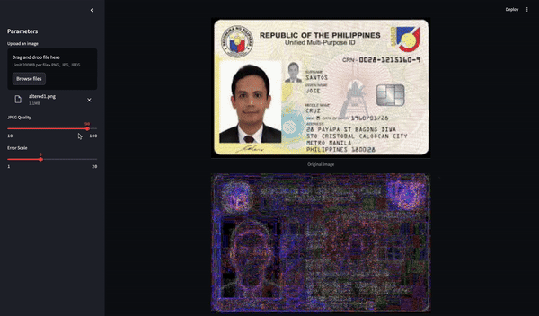
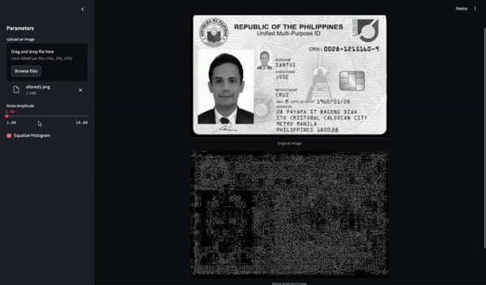

# Fraud Detection for IDs Using Image Forensics

## Overview

In today's digital age, ensuring the authenticity of digital documents such as IDs is crucial. Human eyes alone often cannot distinguish tampered or digitally altered images, as shown in the example below:


To address this challenge, we have developed a powerful Streamlit application that leverages two advanced image forensic techniques: **Error Level Analysis (ELA)** and **Noise Analysis**. These techniques enable the detection of tampered or altered images, making it an invaluable tool for fraud detection.

## Techniques Explained

### Error Level Analysis (ELA)
Demo is below:  


**Math and Approach:**

[ELA](https://www.researchgate.net/publication/373404409_Error_level_analysis_ELA) is a technique that identifies parts of an image that have been altered. The approach involves:
1. Saving the image at a known, high compression level (usually JPEG).
2. Comparing the original image with the recompressed version.
3. Calculating the differences (error levels) between the two images.

The underlying assumption is that altered areas will compress differently than the rest of the image, resulting in higher error levels in those areas.

**Formula:**
`Error = Original_Image - Compressed_Image`
  
The resulting error levels are then enhanced to make the differences more visible.

### Noise Analysis
Demo is below:


**Math and Approach:**

[Noise Analysis](https://www.researchgate.net/publication/314910257_Image_Noise_and_Digital_Image_Forensics) helps identify tampered areas by isolating the noise component of an image. The steps involved are:
1. Converting the image to grayscale.
2. Applying a median filter to remove noise.
3. Subtracting the median-filtered image from the original grayscale image to isolate the noise.

**Formula:**
`Noise = Grayscale_Image - Median_Filtered_Image`
  
Enhanced noise patterns can reveal inconsistencies, such as airbrushing or cloning, that are indicative of tampering.

## Benefits

By using these two techniques, we can create a robust system that:
- Identifies digitally altered images with high accuracy.
- Detects tampered areas that are invisible to the human eye.
- Enhances the security and authenticity verification of digital IDs and documents.

## Installation and Running the Application

### Requirements

Ensure you have Python installed, then install the required packages using the following command:
```bash
pip install -r requirements.txt
```
Running the Application
To run the application locally, use the following command:

```bash
streamlit run ela_noise_app.py
```
This will start a local Streamlit server. Open the provided URL in your browser to interact with the application.
